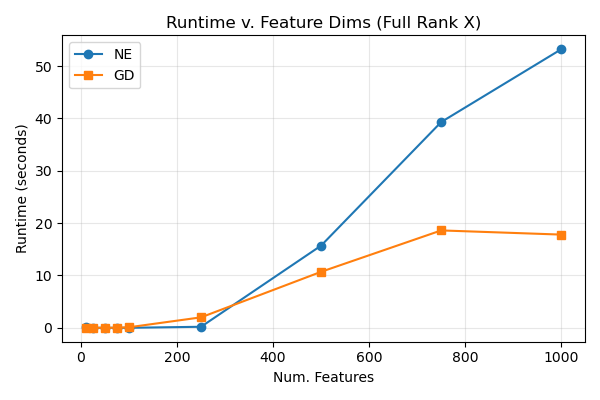
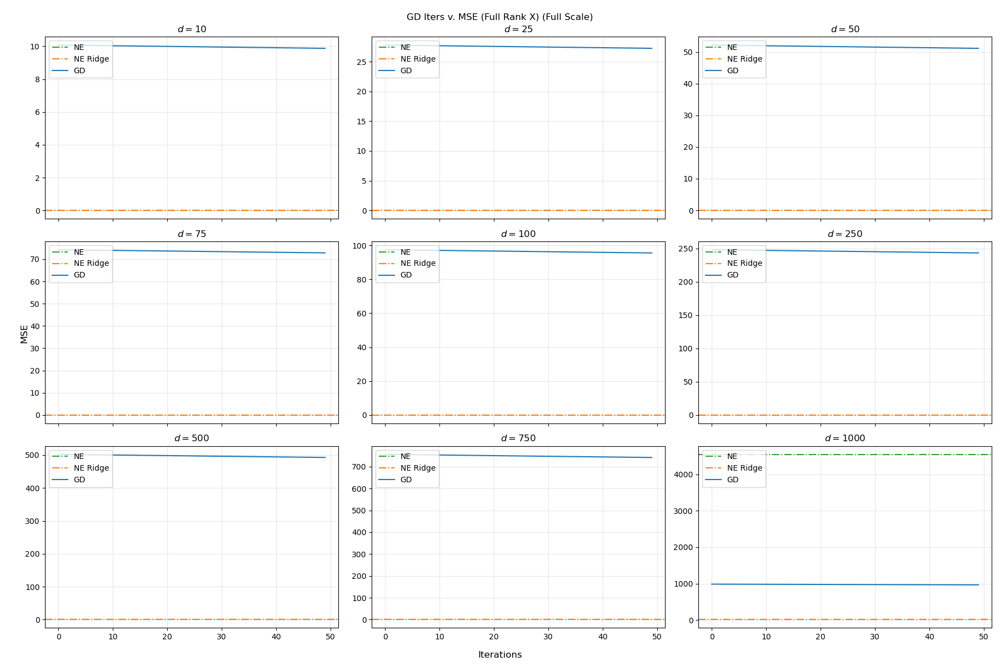
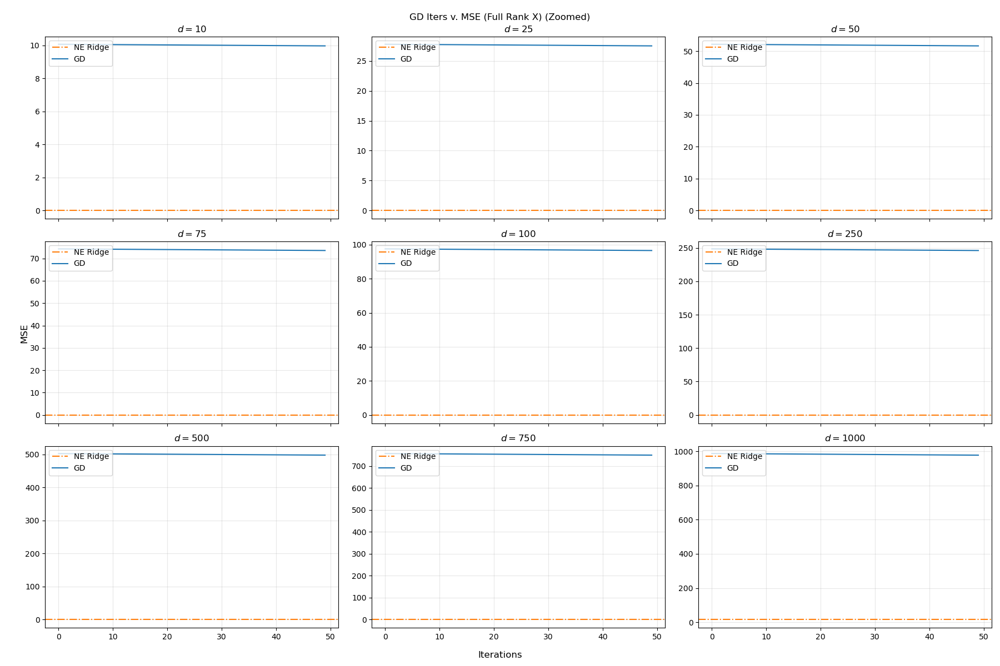
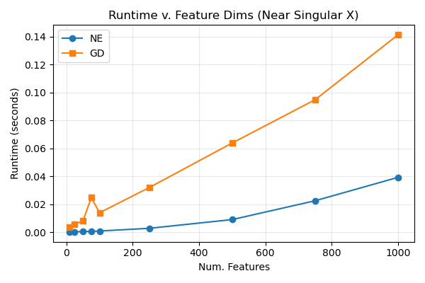
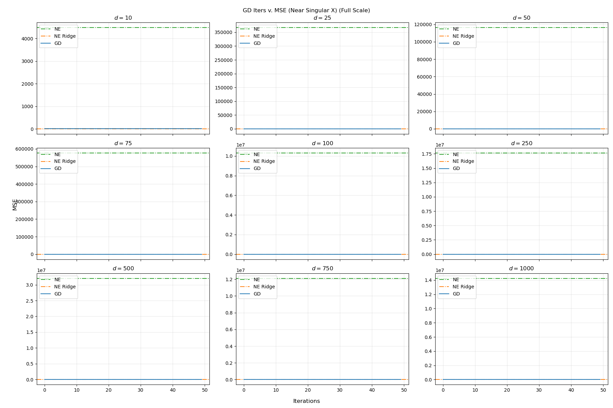
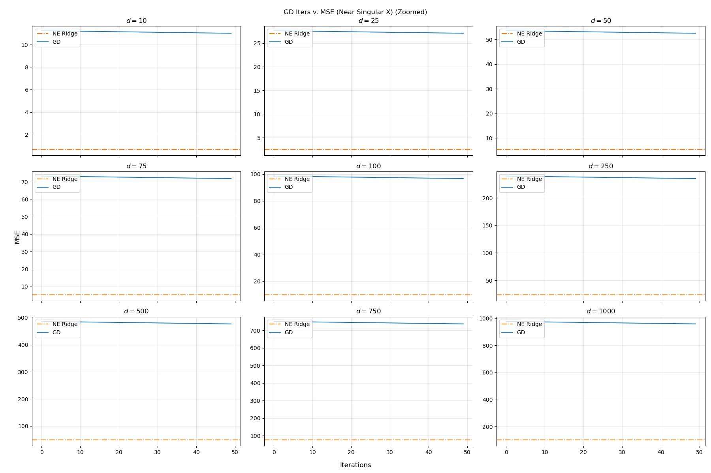
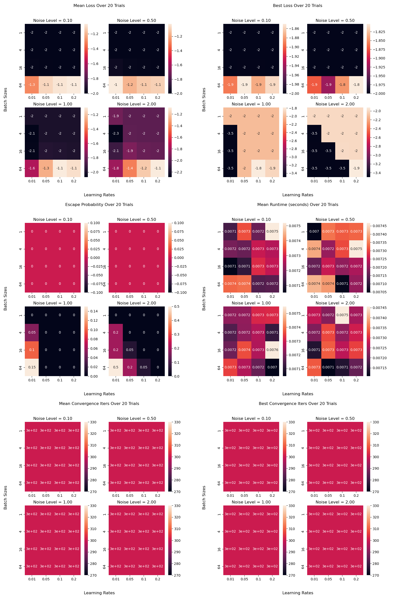
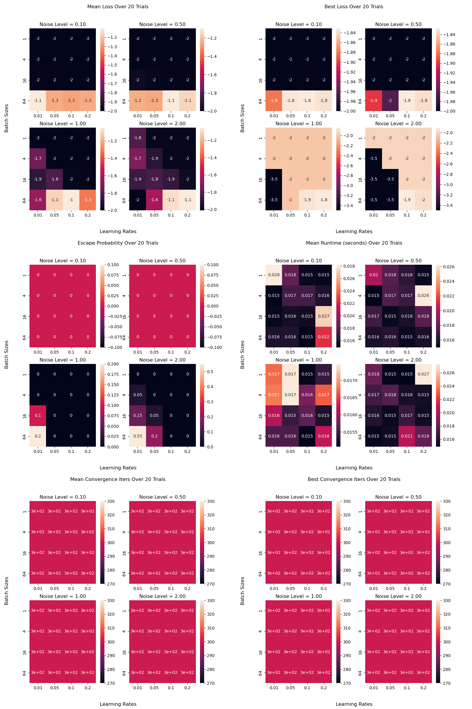
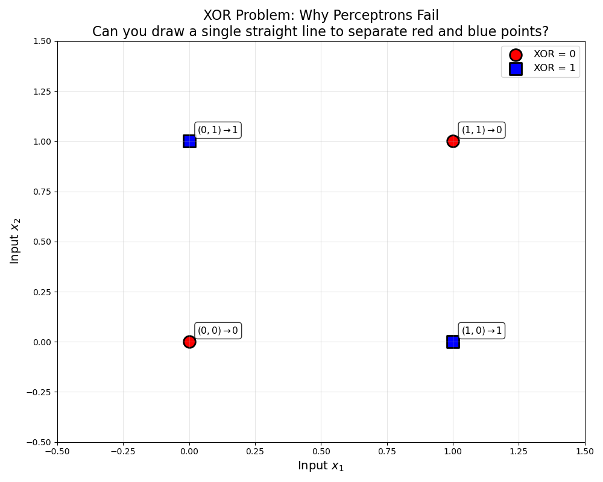
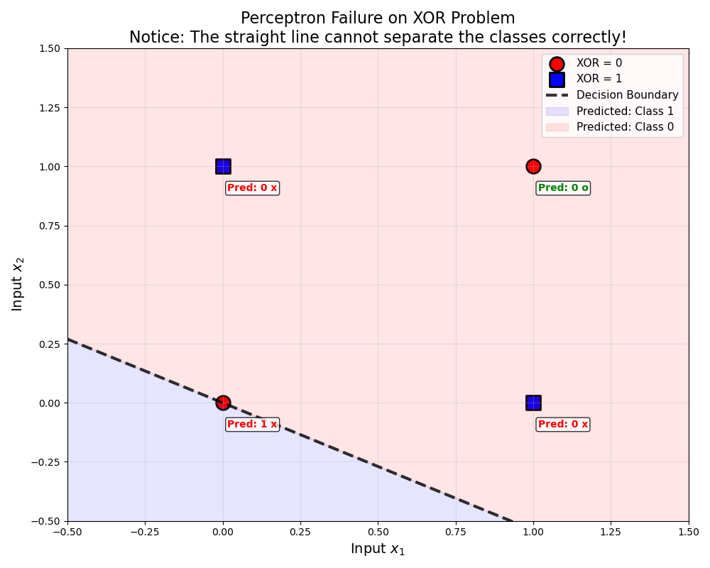

 
## `rvf_fullrank.png`

## `ivm_fullrank_fullscale.png`

## `ivm_fullrank_fullscale.png`

## `rvf_singular.png`

## `ivm_singular_fullscale.png`

## `ivm_singular_zoomed.png`

## `two_hole_heatmaps.png`

## `multi_modal_heatmaps.png`

## `xor_plot.png`

## `decision_boundary.png`

